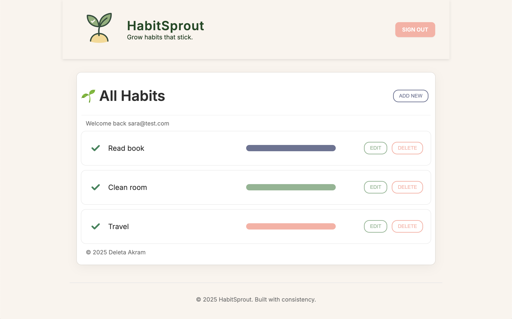
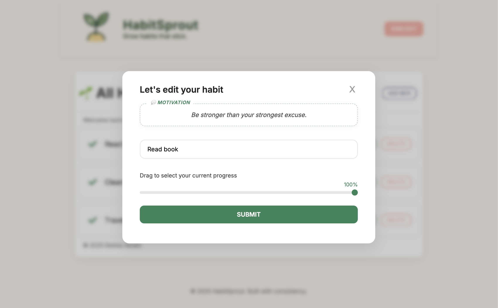

# 🌿 HabitSprout

**HabitSprout** is a fresh and focused habit tracker built with React, Node.js, and Flask. Track your habits with visual progress sliders, stay motivated with daily quotes, and enjoy a clean, mobile-friendly interface — all designed to help you grow habits that stick.

---

## 📸 Screenshot

  


---

## 🖥️ Tech Stack

- **Frontend:** React (Vite)
- **Backend:** Node.js + Express
- **Microservice:** Flask (Motivational Quotes API)
- **Database:** PostgreSQL
- **Styling:** Custom CSS + Inter font + HabitSprout color palette

---

## 🚀 Features

- ✅ Add, edit, and delete habits
- ✅ Visual slider to track progress (0–100%)
- ✅ Motivational quote of the day (served by Flask)
- ✅ Login/signup flow with cookies
- ✅ Mobile-friendly responsive design
- ✅ Fully Git-tracked and `.gitignore`-optimized

---

## 📁 Folder Structure

habitsprout-app/
├── client/ # React frontend
├── server/ # Node.js backend
├── habit-flask/ # Flask API for quotes
├── .gitignore
├── README.md


---

## ⚙️ Getting Started

### 1. Clone the project

```
git clone https://github.com/deardeleta/habit-sprout.git
cd habit-sprout```
```
### 2. Run the React frontend
```
cd client
npm install
npm run dev
```
### 3. Run the Node backend
```
cd ../server
npm install
node server.js
```
### 4. Run the Flask quote API
```
cd ../habit-flask
python3 -m venv venv
source venv/bin/activate
pip install flask flask-cors
python app.py
```
🔐 Environment Variables
<br>
Create a .env file in each folder as needed. Examples:
<br>
server/.env
```
PORT=8000
DATABASE_URL=your_database_connection_string
```
client/.env
```
 VITE_API_URL=http://localhost:8000 
```
habit-flask/.env
(not required unless you add config)

🔮 Future Enhancements

• Dark mode toggle
• Daily habit streaks
• Habit categories + filtering
• User dashboard

👩🏽‍💻 Author

Created by Deleta Akram
Powered by intention, design, and the pursuit of small wins 🌱

📌 License

This project is open source and available under the MIT License.
